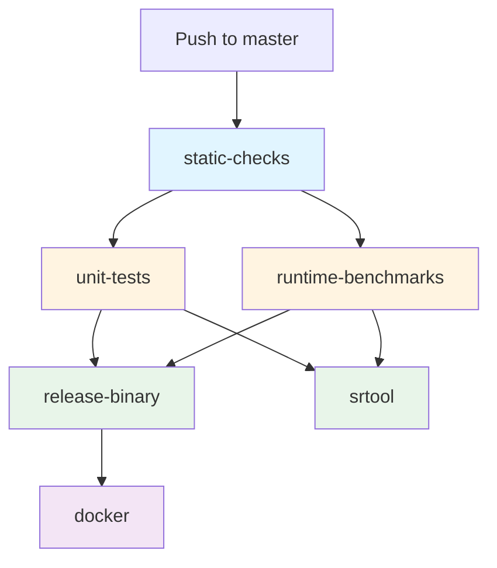
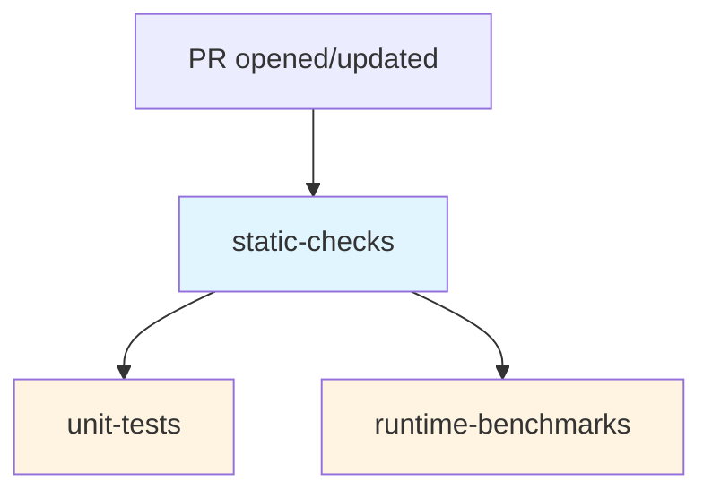
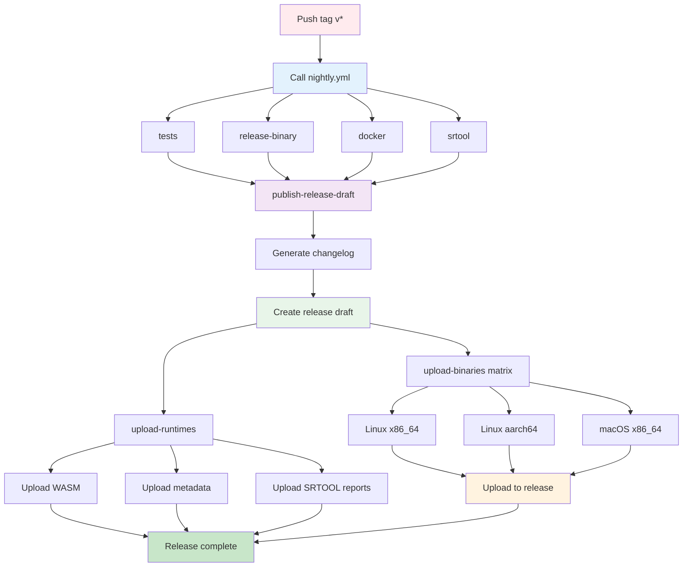

# Robonomics CI/CD Pipeline Documentation

This document provides a comprehensive overview of the GitHub Actions CI/CD pipeline for the Robonomics project.

## Table of Contents

- [Overview](#overview)
- [Workflow Files](#workflow-files)
- [Workflow Execution Flow](#workflow-execution-flow)
- [Caching Strategy](#caching-strategy)
- [Maintenance Guide](#maintenance-guide)

## Overview

The Robonomics CI/CD pipeline is optimized for:
- **Speed**: 30-40% faster via parallel execution
- **Efficiency**: 50% faster subsequent runs with caching
- **Reliability**: Fail-safe strategies for robust builds
- **Cost-effectiveness**: Resource optimization reduces CI costs
- **Security**: Minimal permissions and fork-safe workflows

## Workflow Files

### Core Workflows

#### 1. `nightly.yml` - Nightly Build Pipeline
**Trigger:** Push to `master` branch, or as workflow_call

**Purpose:** Builds and publishes production-ready artifacts

**Jobs:**
```
cachix (Nix cache upload) ────┐
                               │
tests (calls tests.yml) ───────┼─────┐
    ├── static-checks          │     │
    │    ├─ check-formatting   │     │
    │    └─ check-license      │     │
    ├─ unit-tests (parallel)   │     │
    └─ runtime-benchmarks      │     │
            (parallel)          │     │
                                │     │
                ┌───────────────┘     │
                │                     │
                └─→ release-binary    │
                    │                 │
                    └─→ docker        │
                                      │
                    ┌─────────────────┘
                    │
                    └─→ srtool
```

**Workflow Calls:**
- `cachix.yml` - Builds and uploads Nix artifacts to cachix (runs in parallel with tests)
- `tests.yml` - Runs static checks, unit tests, and runtime benchmarks (runs in parallel with cachix)

**Note:** 
- `cachix` and `tests` run independently in parallel
- `release-binary` requires both `cachix` and `tests` to complete (needs Nix cache for builds)
- `srtool` only requires `tests` to complete (doesn't need cachix)
- `docker` depends on `release-binary`

**Outputs:**
- Binary artifacts for Linux (x86_64, aarch64) and macOS (x86_64)
- Docker images for `robonomics/robonomics`
- SRTOOL runtime artifacts
- Runtime metadata and diffs

**Environment Variables:**
- `SUBWASM_VERSION: 0.16.1` - Version of subwasm tool
- `CARGO_TERM_COLOR: always` - Colored output in CI logs
- `CARGO_INCREMENTAL: 0` - Disable incremental compilation for faster CI builds

**Concurrency:**
- Group: `nightly-${{ github.ref }}`
- Cancel in progress: `true`

#### 2. `tests.yml` - Comprehensive Test Workflow
**Trigger:** 
- Push to `feat/*`, `fix/*`, `release/*` branches
- Pull requests (opened, synchronize, reopened) to those branches
- Workflow call from other workflows (e.g., nightly.yml)

**Purpose:** Runs all tests including unit tests and runtime benchmarks

**Jobs:**
```
static-checks (5-10 min)
    ├── unit-tests (15-20 min, parallel)
    └── runtime-benchmarks (15-20 min, parallel)
```

**Workflow Calls:**
- `static.yml` - Static code checks

**Features:**
- Rust toolchain caching via `actions-rust-lang/setup-rust-toolchain@v1`
- Uses `cargo-nextest` for parallel test execution
- Runtime benchmark validation with Nix
- All tests run in parallel after static checks complete

**Concurrency:**
- Group: `tests-${{ github.ref }}`
- Cancel in progress: `true`

#### 3. `static.yml` - Static Code Checks and Auto-Formatting
**Trigger:**
- Pull requests (opened, synchronize, reopened)
- Workflow call from other workflows

**Purpose:** Performs static analysis, formatting checks

**Jobs:**
```
─ check-formatting
─ check-license
```

**Features:**
- **check-formatting**: Verifies Rust code formatting (`cargo fmt --check`) and TOML formatting (`taplo fmt --check`)
- **check-license**: Validates license headers

**Note:** Auto-format only runs on pull requests, not on workflow_call. Check jobs are skipped for draft PRs.

### Supporting Workflows

#### 4. `release.yml` - Release Pipeline
**Trigger:** Push tags matching `v[0-9]+.[0-9]+.[0-9]+*`

**Purpose:** Automates GitHub release creation and binary artifact publishing

**Jobs:**
- **nightly** - Calls `nightly.yml` workflow (builds binaries, docker, srtool)
- **publish-release-draft** - Creates GitHub release draft:
  - Downloads runtime artifacts
  - Generates release body using TypeScript script comparing tags
  - Creates draft release with generated notes
- **upload-binaries** - Uploads binary artifacts for:
  - Linux (x86_64, aarch64) musl targets
  - macOS (x86_64) darwin target
- **upload-runtimes** - Uploads runtime artifacts:
  - Compressed WASM runtime
  - Runtime metadata JSON
  - SRTOOL digest and compressed info

**Features:**
- Automatic changelog generation between releases
- Matrix strategy for multi-platform binary uploads
- SRTOOL report integration in release notes
- Concurrent artifact uploads for faster releases

**Concurrency:** Not configured (releases run to completion)

#### 5. `docs.yml` - Documentation Pipeline
**Trigger:** Push to `master` branch

**Purpose:** Builds and deploys Rust documentation to GitHub Pages

**Jobs:**
- **build** - Builds cargo documentation:
  - Uses Nix development environment
  - Generates workspace docs with `cargo doc`
  - Creates HTML redirect to main docs
  - Uploads documentation artifact
- **deploy** - Deploys to GitHub Pages:
  - Publishes documentation artifact
  - Updates GitHub Pages site

**Features:**
- Clean builds to ensure documentation freshness
- Automatic redirect to main Robonomics docs
- GitHub Pages integration

**Concurrency:**
- Group: `deploy`
- Cancel in progress: `false` (ensures deployment completes)

#### 6. `cachix.yml` - Nix Cache Management
**Trigger:** Workflow call from other workflows (e.g., nightly.yml, zombienet.yml)

**Purpose:** Builds and uploads Nix artifacts to Cachix for faster subsequent builds

**Jobs:**
- **cachix-upload** - Builds and caches Nix packages:
  - Aggressive cleanup to free disk space (~40GB freed)
  - Builds main Robonomics binary
  - Builds additional Nix packages (libcps, polkadot, polkadot-parachain)
  - Uploads artifacts to Cachix cache

**Features:**
- Disk space optimization through aggressive cleanup
- Multiple build targets (main + dependencies)
- Local testnet environment validation
- Status output for dependent workflows

**Concurrency:**
- Group: `cachix-${{ github.ref }}`
- Cancel in progress: `true`

#### 7. `zombienet.yml` - Network Integration Tests
**Trigger:** 
- Pull requests to `master` branch
- Push to `master` branch
- Manual workflow dispatch

**Purpose:** Runs integration tests using Zombienet local network

**Jobs:**
- **cachix** - Calls `cachix.yml` to build and cache dependencies
- **zombienet-tests** - Runs integration tests:
  - Spawns local Zombienet network (relay chain + parachain)
  - Waits for network initialization (ports 9944, 9910, 9988)
  - Executes JavaScript integration tests
  - Uploads logs on failure for debugging

**Features:**
- Background network spawning with health checks
- Node.js module caching
- Timeout protection (60 minutes)
- Automatic log artifact collection on failure

**Concurrency:** Not configured (tests run sequentially)

## Workflow Execution Flow

### Nightly Pipeline (Master Branch)



**Timeline:**
- **0-10 min**: Static checks (formatting, licenses)
- **10-30 min**: Tests run in parallel (unit tests + benchmarks)
- **30-70 min**: Builds run in parallel (release binaries + SRTOOL)
- **70-85 min**: Docker image build and push

**Total Duration:** ~60-85 minutes (optimized from ~90-120 minutes)

### Pull Request Pipeline



**Timeline:**
- **0-10 min**: Static checks
- **10-30 min**: Tests run in parallel

**Total Duration:** ~20-30 minutes (optimized from ~30-45 minutes)

### Release Pipeline (Tag Push)



**Timeline:**
- **0-60 min**: Nightly build workflow (tests, binaries, docker, srtool)
- **60-65 min**: Generate release notes from commit history
- **65-70 min**: Create draft release
- **70-80 min**: Upload binary artifacts (parallel matrix) and runtime artifacts

**Total Duration:** ~70-80 minutes

## Caching Strategy

### Rust Toolchain Cache

**Enabled in:** `actions-rust-lang/setup-rust-toolchain@v1` with `cache: true`

**What's Cached:**
- Cargo registry and index
- Cargo git dependencies
- Build artifacts in `target/`
- Installed tools from `cargo install`

**Cache Key:** Automatically managed by the action based on:
- `Cargo.lock` hash
- Rust toolchain version
- Runner OS

**Benefits:**
- 50% faster subsequent runs
- Eliminates re-downloading dependencies
- Reuses compiled artifacts when possible
- No manual cache configuration needed

**Note:** The `actions-rust-lang/setup-rust-toolchain` action provides comprehensive caching out of the box, so we don't need separate `actions/cache@v4` steps for Cargo dependencies.

### Docker Layer Cache

**Type:** GitHub Actions cache (`type=gha`)

**Configuration:**
```yaml
cache-from: type=gha
cache-to: type=gha,mode=max
```

**Benefits:**
- Faster Docker builds
- Reduced bandwidth usage
- Layer reuse across builds

### Taplo Binary Cache

**Path:** `/usr/local/bin/taplo`

**Key:** `taplo-cli-${{ runner.os }}`

**Benefits:**
- Avoid repeated downloads
- Faster static checks

## Maintenance Guide

### Adding a New Job

1. Determine dependencies (which jobs must complete first)
2. Add appropriate caching configuration
3. Update workflow_call outputs if needed
4. Test with a PR before merging

### Updating Dependencies

**Rust Toolchain:**
- Update in `release-binary` job: `toolchain: "1.88.0"`
- Cache will automatically invalidate

**Actions:**
- Keep actions up to date (currently using v4/v5)
- Test thoroughly after updating major versions

**Tools:**
- Update version in env vars (e.g., `SUBWASM_VERSION`)
- Cache keys will automatically handle updates

### Debugging Workflow Issues

**Common Issues:**

1. **Cache Miss:**
   - Check if `Cargo.lock` changed
   - Verify cache restore-keys are correct
   - Look for cache eviction messages

2. **Job Dependency Errors:**
   - Verify `needs:` references correct job names
   - Check for circular dependencies
   - Ensure required jobs exist

3. **Artifact Not Found:**
   - Check artifact name matches between upload/download
   - Verify producing job completed successfully
   - Check retention period hasn't expired

4. **Timeout Issues:**
   - Increase timeout-minutes if needed
   - Check for hanging processes
   - Review cache effectiveness

### Performance Monitoring

**Metrics to Track:**
- Total pipeline duration
- Individual job durations
- Cache hit rates
- Artifact storage usage
- Concurrent job execution

**Tools:**
- GitHub Actions insights
- Workflow run logs
- Cache usage dashboard

### Best Practices

1. **Keep Jobs Focused:** Each job should have a single responsibility
2. **Use Caching:** Always cache dependencies and build artifacts
3. **Parallelize:** Identify independent jobs and run them in parallel
4. **Fail Fast for Errors:** Use `fail-fast: false` only for matrix builds
5. **Clean Artifacts:** Set appropriate retention periods
6. **Document Changes:** Update this README when modifying workflows

## Security Considerations

### Secrets Management

Secrets used in workflows:
- `DOCKER_USERNAME`: DockerHub username
- `DOCKER_PASSWORD`: DockerHub password
- `GITHUB_TOKEN`: Automatically provided by GitHub

**Never:**
- Hardcode secrets in workflow files
- Log secret values
- Pass secrets to untrusted code

### Dependency Security

- Use pinned action versions (e.g., `@v4`, not `@main`)
- Review action source code before using
- Keep dependencies updated for security patches

### Artifact Security

- Artifacts are accessible to repository collaborators
- Don't upload sensitive data as artifacts
- Use short retention periods for intermediate artifacts

## Troubleshooting

### Common Error Messages

**"Resource not accessible by integration"**
- Check workflow permissions
- Verify GITHUB_TOKEN has required scopes

**"Cache service responded with 429"**
- Rate limit hit, cache will be skipped
- Workflow will continue without cache

**"Unable to download artifact"**
- Verify artifact was uploaded successfully
- Check artifact name matches exactly
- Ensure retention period hasn't expired

### Getting Help

1. Check workflow logs for detailed error messages
2. Review GitHub Actions documentation
3. Search existing issues in the repository
4. Open a new issue with workflow run link

## Contributing

When modifying workflows:

1. Test changes in a feature branch first
2. Document changes in this README
3. Update job dependency diagrams
4. Monitor first few runs for issues
5. Adjust caching keys if needed

## Resources

- [GitHub Actions Documentation](https://docs.github.com/en/actions)
- [Rust Toolchain Action](https://github.com/actions-rust-lang/setup-rust-toolchain)
- [Docker Build Push Action](https://github.com/docker/build-push-action)
- [SRTOOL](https://github.com/chevdor/srtool)
- [cargo-nextest](https://nexte.st/)
